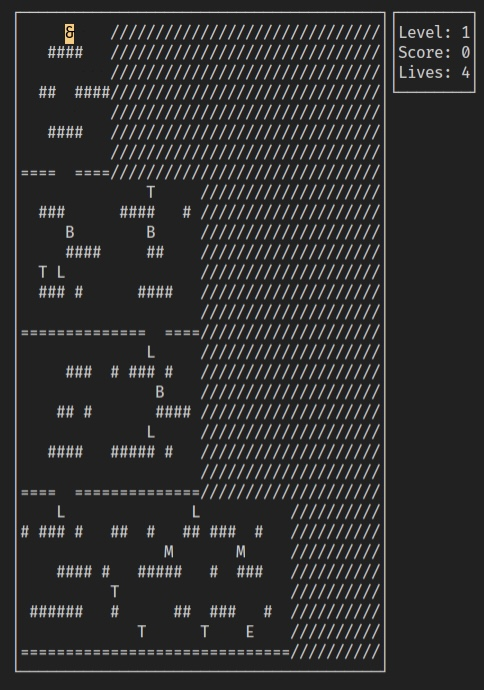

# Rush

Top-Down Platform-based game written in C++.

  

## Installation

Download the game folder and navigate to it.
To compile the source files, use the `make` command, and use `./game` to start the game.

## Description

### Controls

Use Arrow keys to move the character and WASD to shoot.

### The Game

The objective of the game is to pass as many levels as possible.
The game ends when you run out of lives.

### Map

The map contains the following characters:

- &: represents the player;
- B: represents a bonus;
- L: represents a life;
- T: represents a TEnemy;
- M: represents an MEnemy;
- S: represents the spawn door;
- E: represents the exit door;
- \*: represents a shot;

### Scoring

The score is increased when:

- a bonus is collected (+10);
- a TEnemy is killed (+5);
- an MEnemy is killed (+10);

### Lives

Lives increase when a life is collected. Lives decrease if you collide with a TEnemy or an MEnemy.

### Levels

To advance to the next level, you need to reach the exit door 'E' and press the 'E' key.
You can return to the previous level by going back to the spawn door 'S' and pressing the 'Q' key.
